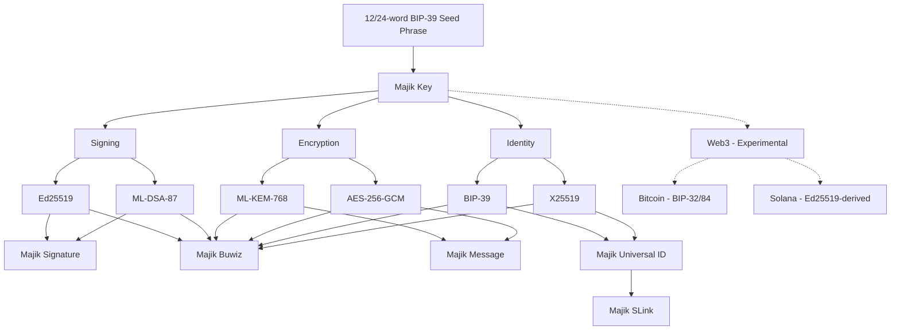

# Majik Key Client

 

   

**Majik Key Client** is the foundational root class that powers all Majikah application clients. It acts as the central orchestration layer for `@majikah/majik-key`, handling everything from multi-account lifecycle management to client state persistence, so downstream apps (like Majik Signature or Majik Buwiz) get unified, battle-tested cryptographic management out of the box.

---

## Why Majik Key Client?

When building products on top of `Majik Key` (which turns a BIP-39 mnemonic into a hybrid post-quantum identity), applications consistently need the same infrastructure:
- **Account Management**: Creating, importing, updating, and removing cryptographic identities.
- **State Persistence**: Safely storing locked `MajikKey` instances in a keystore, tracking which account is active, and persisting user preferences.
- **Session Security**: Providing unified lock/unlock flows, passphrase verification, and lifecycle events.

Instead of duplicating this logic in every app, `@majikah/majik-key-client` provides it all in a single abstract class: `MajikKeyClient`. 

By extending this class, a child client gets robust, event-driven key management for free, leaving the child class responsible only for its specific domain logic (e.g., managing a contact directory or signing files).

---

## Features

- **Centralized Keystore Management**: Uses `MajikKeyManager` to seamlessly read and write `MajikKey` data to any storage adapter (in-memory by default, extensible to SQLite, IndexedDB, etc.).
- **Client State Synchronization**: Manages the ordering of loaded accounts and tracks the currently active identity via `MajikKeyClientStateManager`.
- **Event-Driven Architecture**: Exposes typed event hooks (`new-account`, `unlock`, `active-account-change`, `error`, etc.) making it easy to wire up reactive UIs.
- **Account Hydration & Recovery**: Built-in methods to hydrate keys from storage on boot, and robust flows to import or replace accounts from Mnemonic backups.
- **Agnostic Domain Logic**: Deliberately abstracts away the contact directory shape via hooks (`_buildOwnAccountContact`, `_onAccountRegistered`, `_onAccountRemoved`). Subclasses define what a "Contact" looks like in their ecosystem.

---

## Architecture Overview

## Ecosystem

- [Majik Signature Web App](https://signature.majikah.solutions)
- [Majik Signature on Microsoft Store](https://apps.microsoft.com/detail/9pl9g3xzvd1x)
- [Majik Signature Official Repository](https://github.com/Majikah/majik-signature)
- [Majikah Solutions](https://majikah.solutions)

---

## License

**License:** [Apache-2.0](LICENSE) — free for personal and commercial use.

## Author

Developed by **Josef Elijah Fabian (Zelijah)** | [Majikah Solutions OPC](https://majikah.solutions/about)

**Developer**: [Josef Elijah Fabian](https://github.com/jedlsf)

**GitHub**: [https://github.com/Majikah](https://github.com/Majikah)

**Project Repository**: [https://github.com/Majikah/majik-signature](https://github.com/Majikah/majik-signature)

**Technical Whitepaper**: [https://zenodo.org/records/21339132](https://zenodo.org/records/21339132)

---

## Contact

- **Business Email**: [business@majikah.solutions](mailto:business@majikah.solutions)
- **Official Website**: [https://www.thezelijah.world](https://www.thezelijah.world)
- **Majikah Ecosystem**: [https://majikah.solutions](https://majikah.solutions)